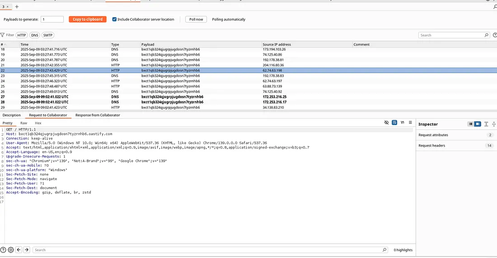
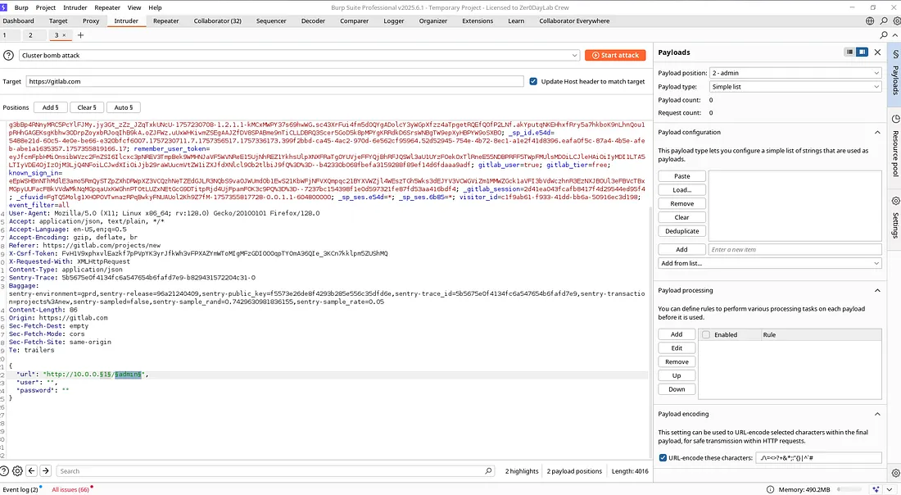
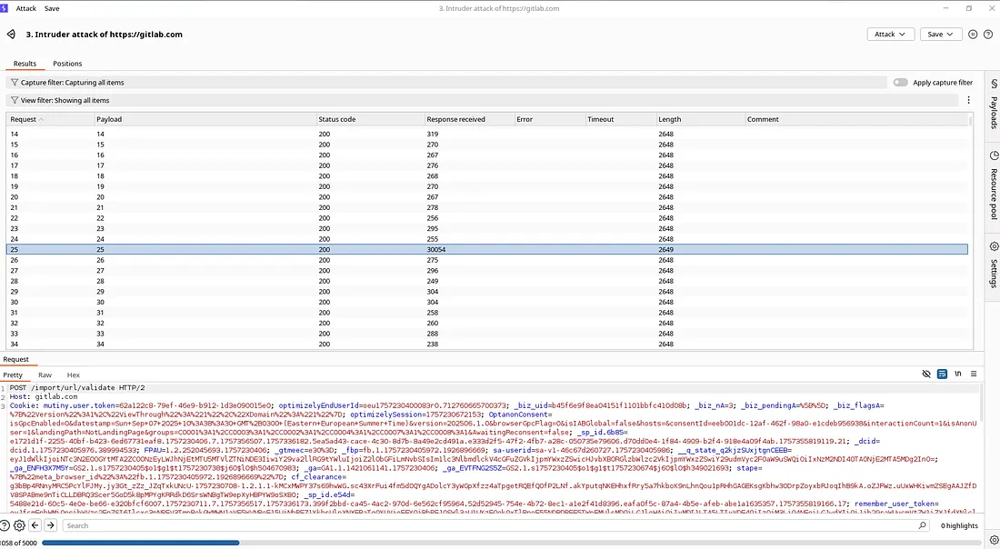

#SSRF in GitLab Self-Hosted — Import From URL

####Summary

I discovered a Server-Side Request Forgery (SSRF) vulnerability in the “Import Project from URL” feature of a GitLab self-hosted instance. The vulnerability allows an authenticated user to force the GitLab server to issue HTTP requests to arbitrary URLs. Crucially, the server’s response timings differ based on whether the target port is open or closed, enabling an attacker to use this vulnerability not just for a single request but to actively probe and map the internal network.

This write-up provides a safe, lab-tested Proof of Concept (PoC) and recommended mitigations for security engineers, bug bounty hunters, and DevOps teams.

**TL;DR:**
- Feature: `Import Project` -> `From URL` (GitLab self-hosted)
- Vulnerability: SSRF due to insufficient validation of user-supplied URLs.
- Impact: The vulnerability’s impact is elevated from a standard “Blind SSRF” to Internal Network Reconnaissance (Port Scanning) due to observable timing differences on connection attempts. This could lead to the discovery of internal admin panels, databases, or cloud metadata endpoints.

**Important:** All testing described here was performed in a controlled lab environment. Do not attempt to reproduce these steps against production systems or networks you do not have explicit permission to test.

####Technical Details

- Environment: GitLab Self-Hosted Instance (Lab Deployment)
- Tools Used: Burp Suite Professional (Interceptor, Intruder, Collaborator), `curl`.

####Reproduction Steps (Lab Environment Only)

**Step 1: Confirming the Outbound Request (Basic SSRF)**

The first step is to confirm that the GitLab server makes an outbound request to the URL provided by the user.

1. Set up a Callback Server: Use Burp Collaborator or run a web server you control that logs all incoming HTTP requests (e.g., `http://your-callback-server.com`).
2. Trigger the Import: In the GitLab UI, navigate to `Import Project` -> `From URL`.
3. Enter Callback URL: In the “Git repository URL” field, enter your callback server address.
4. Verify the Callback: Check your server logs. You should see an incoming `GET` or `POST` request originating from the GitLab server's IP address. This confirms the basic SSRF behavior.

*Burp Collaborator receiving a DNS and HTTP callback from the GitLab instance, confirming the server-side request.*

**Step 2: Proving Internal Network Probing (Advanced Impact)**

This step demonstrates the true risk of the vulnerability: using it to scan the internal network.

1. Intercept the Request: Using Burp Suite, trigger the import again but intercept the `POST` request sent to the GitLab server (e.g., to a project creation endpoint).
2. Identify the Target Parameter: Locate the parameter containing the repository URL (e.g., `import_url`).
3. Send to Intruder: Send the request to Burp Intruder.
4. Configure the Payload: Set the payload position on the port number of an internal IP address (e.g., `http://192.168.1.10:§80§`).
5. Observe Timing Differences:
   - **Open Port:** If the internal port is open, the GitLab server might respond relatively quickly (e.g., with an "invalid git repository" error).
   - **Closed Port:** If the port is closed or filtered, the connection attempt will likely time out, resulting in a significantly longer response time from the GitLab server.
6. Analyze Results: By comparing the response times in Burp Intruder, you can accurately map which internal services are active.

*Burp Intruder results showing distinct timing differences between open and closed internal ports.*

####Practical Proof of Concept (Lab Reproduction)

I have successfully reproduced the SSRF vulnerability on a self-hosted GitLab instance.

**PoC Details:**
- **Victim:** GitLab CE running on a VM (192.168.1.18).
- **Attacker:** Kali Linux VM (192.168.1.12) on the same network.

**Steps:**
1. I started a netcat listener on the attacker machine.
2. I used Burp Suite to send a modified request to the `/import/url/validate` endpoint.
3. I pointed the `url` parameter to my listener.
4. The GitLab server immediately connected back to my machine.

<video controls width="100%" height="auto">
  <source src="poc_video.mp4" type="video/mp4">
</video>

####Impact and Remediation

**Impact:**
An attacker can bypass network firewalls to:
- Map the internal network architecture.
- Identify internal services (databases, admin panels, etc.).

**Remediation:**
1. **Allowlist URLs:** Implement a strict allowlist of approved domains and protocols for the import feature.
2. **Block Internal IP Ranges:** Explicitly block requests to private IP ranges (RFC 1918) and the loopback address (127.0.0.1).
3. **Disable Unused Protocols:** Only allow `http://` and `https://` if necessary, and disable protocols like `file://`, `gopher://`, or `ftp://`.
4. **Network-Level Egress Filtering:** Use firewalls or security groups to restrict the GitLab server's outbound traffic to only necessary external destinations.